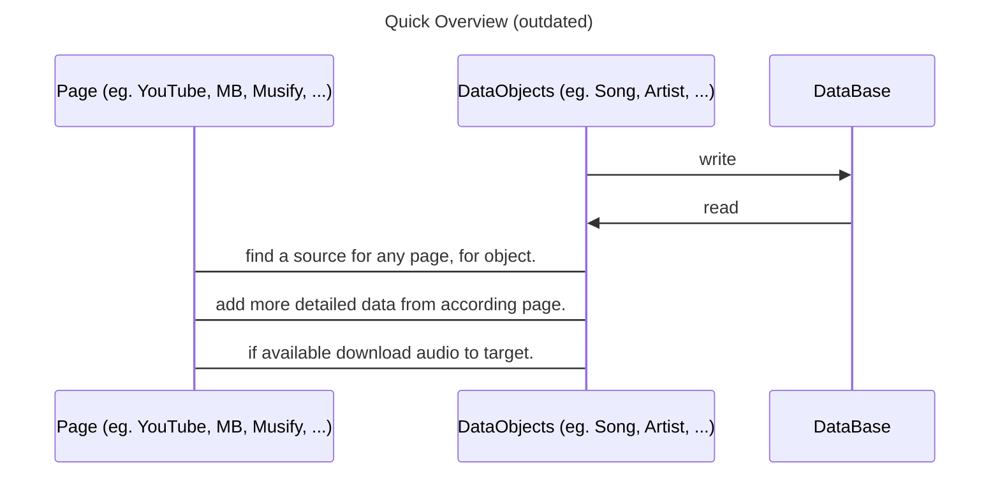
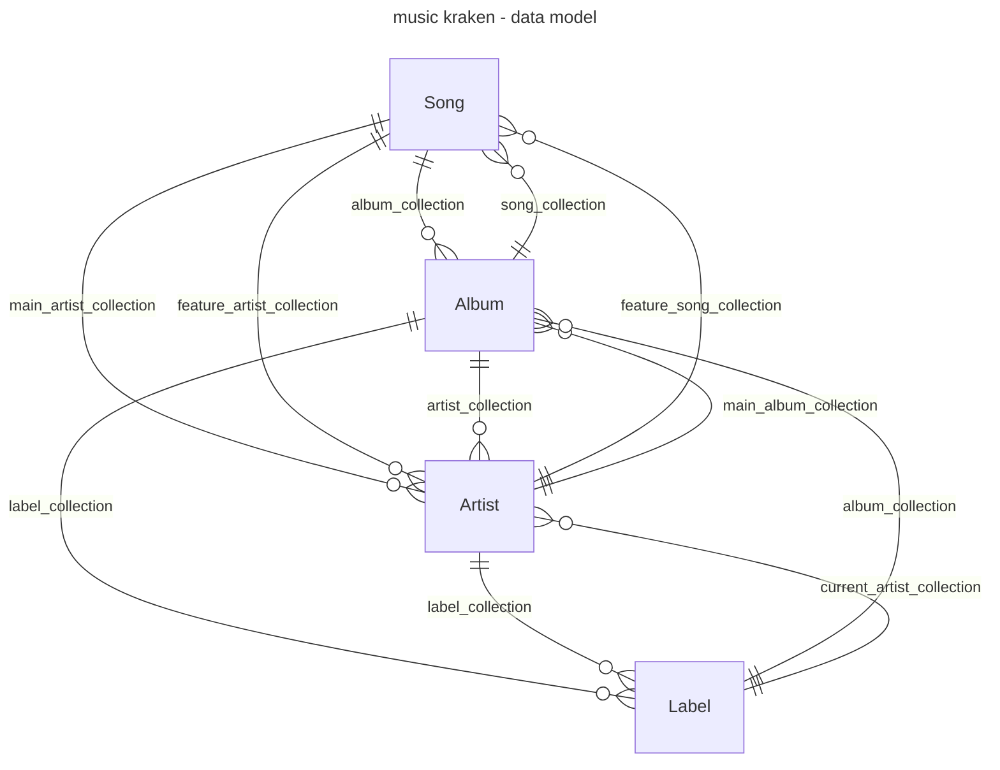

# Music Kraken

[](https://ci.elara.ws/repos/59)


- [Installation](#installation)
- [Quick-Guide](#quick-guide)
  - [How to search properly](#query)
- [CONTRIBUTE](#contribute)
- [Matrix Space](#matrix-space)
---

## Installation

You can find and get this project from either [PyPI](https://pypi.org/project/music-kraken/) as a Python-Package,
or simply the source code from [Gitea](https://gitea.elara.ws/music-kraken/music-kraken-core). **

> **NOTES**
>
> - Even though everything **SHOULD** work cross-platform, I have  only tested it on Ubuntu.
If you enjoy this project, feel free to give it a star on GitHub.

### From source

```sh
git clone https://gitea.elara.ws/music-kraken/music-kraken-core.git
python3 -m pip install -e music-kraken-core/
```

To update the program, if installed like this, go into the `music-kraken-core` directory and run `git pull`.

### Get it running on other Systems

Here are the collected issues, that are related to running the program on different systems. If you have any issues, feel free to open a new one.

#### Windows + WSL

Add ` ~/.local/bin` to your `$PATH`. [#2][i2]

## Quick-Guide

The **Genre** you define at the start, is the folder my program will download the files into, as well as the value of the ID3 genre field.

When it drops you into the **shell** 2 main things are important:

1. You search with `s: <query/url>`
2. You choose an option with just the index number of the option
3. You download with `d: <options/url>`, where the options are comma separated

### Query

The syntax for the query is really simple.

```mk
> s: #a <any artist>
searches for the artist <any artist>

> s: #a <any artist> #r <any release>
searches for the release (album) <any release> by the artist <any artist>

> s: #r <any release> Me #t <any track>
searches for the track <any track> from the release <any relaese>
```

The escape character is as usual `\`.

---

## Contribute

I am happy about every pull request. To contribute look [here](contribute.md).

## Matrix Space


I decided against creating a discord server, due to various communities get often banned from discord. A good and free Alternative are Matrix Spaces. I recommend the use of the Client [Element](https://element.io/download). It is completely open source.

**Click [this invitation](https://matrix.to/#/#music-kraken:matrix.org) _([https://matrix.to/#/#music-kraken:matrix.org](https://matrix.to/#/#music-kraken:matrix.org))_ to join.**

---

# Programming Interface / Use as Library

This application is $100\%$ centered around Data. Thus, the most important thing for working with musik kraken is, to understand how I structured the data.  

## Quick Overview

- explanation of the [Data Model](#data-model)
- how to use the [Data Objects](#data-objects)
- further Dokumentation of _hopefully_ [most relevant classes](documentation/objects.md)
- the [old implementation](documentation/old_implementation.md)



## Data Model

Music metadata can be easily abstracted to a few main Entities with some relations between them. This enables the easy scraping and aggregation of the correct metadata for each Song. Those Entities are `Song`, `Album`, `Artist` and `Label`.

<details>
This is convenient because then I can just use for example one Artist, which adds its metadata shared and consistently to each of its song. This exactly was the reason why piracy was such a mess in the past. Metadata has a lot of redundancy, but the relational databases of streaming services don't. THIS is the main reason for this program, and in my opinion also the reason for the widespread adoption of streaming services.
</details>



[i10]: https://github.com/HeIIow2/music-downloader/issues/10
[i2]: https://github.com/HeIIow2/music-downloader/issues/2
